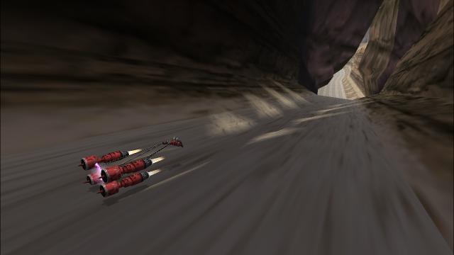

# Annodue



**A universal extension platform for *STAR WARS Episode I Racer* oriented toward speedrunning.**

Annodue adds new features, quality of life adjustments and cosmetic changes, as well as a plugin system for user-made extensions.

See [MANUAL](MANUAL.md) for a complete feature summary and configuration instructions.

See [CHANGELOG](CHANGELOG.md) for a complete version history.


##### *Disclaimer*

*Annodue is in active development and not yet greenlit for submissions to Speedrun.com at the time of writing. For current information on how this can be used for speedrunning, please contact the speedrun moderators via the [Racer discord server](https://discord.com/servers/star-wars-episode-i-racer-441839750555369474) or [speedrun.com](https://www.speedrun.com/swe1r).*

## Installation

### From release

1. Download `annodue-<version>.zip` from the [latest Release](https://github.com/everalert/annodue/releases/latest).
2. Extract `dinput.dll` and the `annodue` folder into the game directory.
3. (Optional) If you normally need to run a specific `dinput.dll` to prevent the game from crashing, place it in the `annodue` folder.

### From build

2. Generate the release files with the following command in a terminal in the project directory. You must have `zig 0.11.0` installed.
```zig
zig build release -Doptimize=ReleaseSafe -Drop="<release_output_path>"
```
3. Find `annodue-0.1.6.zip` in `<release_output_path>/0.1.6/` and extract it to the game directory.

## Building from source

The source code can be found on github: [annodue](https://github.com/everalert/annodue)

### Build options

The main component of Annodue is written in Zig, and requires `Zig 0.11.0` to build.

Open a terminal in the project directory and run the following:
```
zig build <options>
```

The build process can be customized with the following options.

|Option|Note|
|:---|:---|
|`dinput`|Build only dinput.dll.
|`plugins`|Build only the plugin DLLs.
|`hashfile`|Build the plugin DLLs and generate their hashes, without building the main DLL.
|`release`     |Build entire project and package for release. Currently requires `-Drop`, and using `-Doptimize` is also recommended.
|`-Drop=<path>`|Output base path of release build; files will be placed in `<path>/<ver>`. Required for `release`.
|`-Ddev`|Build with developer options. Skips applying the core plugin hash check to the main DLL, etc.
|`-Dcopypath=<path>`|Path to the game directory, for hot-reloading DLLs during development. Only available when using `-Ddev`.
|`-Doptimize=<build_mode>`|Build mode; see [Zig documentation](https://ziglang.org/documentation/0.11.0/#Build-Mode) for options. Currently requires `Debug` to NOT be set to enable network updating, due to a standard library bug.

See the output of `zig build -h` for further build options.

## Contributing

**Disclaimer:** As the project is in early stages, I would prefer to focus my energy on development, and user plugin development is not supported until the codebase stabilizes. That said, I would be more than happy to discuss the project on the [Racer discord server](https://discord.com/servers/star-wars-episode-i-racer-441839750555369474) and take feedback and suggestions. *For the time being, the following is aimed at those I have discussed contributing with personally.*

This project follows the classic [git-flow](https://nvie.com/posts/a-successful-git-branching-model/) branching model. It is assumed you know the basics of git.

### Initial Setup

1. Fork this repository on GitHub
2. Clone your fork
```
git clone https://github.com/USERNAME/annodue
```
3. Move into the new `annodue` directory
```
cd annodue
```
4. Configure upstream
```
git remote add upstream https://github.com/everalert/annodue
git fetch upstream
```

### Development

1. Features are based on the `develop` branch. Begin there and ensure it's up-to-date.
```
git checkout develop
git pull --rebase upstream develop
```
2. Create a feature branch, typically following the pattern `ft/<feature_name>`.
```
git checkout -b ft/supremo-featrino
```
3. Do yo thang baby.
4. Once you're done, push the branch to your fork.
```
git push origin ft/supremo-featrino
```
5. Submit a pull request from your feature branch to the `develop` branch in `everalert/annodue`.
6. Party. Woo!
7. Don't forget to do step 1 again if you want to work on another feature.
8. If you would like to merge to or from the `develop` branch for whatever reason, default to using the `--no-ff` flag. But it would totally make both our lives easier if you just stuck to feature branches man.

### Contributor Credit

- [tly000](https://github.com/tly000)
- [jcm93](https://github.com/jcm93)
- [DeonPoncini](https://github.com/DeonPoncini)

## License

This project is under the MIT License. The portions of the project this does not apply to have their own license notifications.
